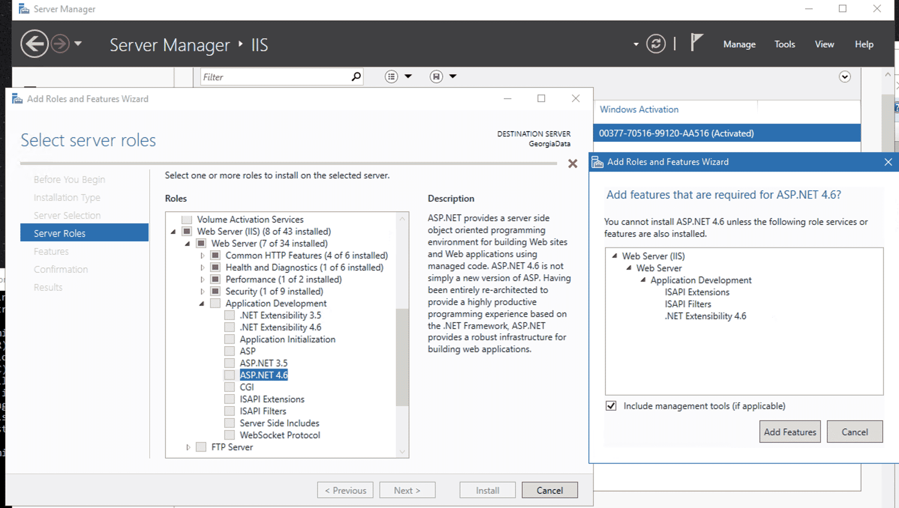

<b>Site Setup</b> 
<a href="../localsite/start/">Localsite Starter</a> 
<a href="#server">Server Setup</a> 
<a href="#database">Database Setup</a> 
<a href="#email">Email Setup</a> 
<!--<a href="about/">About Web API</a> -->

 
 

# Resource and event calendars

Developed in partnership with [NAAEE](https://naaee.org) and the [Southeast Enviromental Education Alliance](http://www.southeastee.com/) for states including [Georgia](http://eeingeorgia.org/core/news/list.aspx), [North Carolina](http://web.eenorthcarolina.org/core/event/calendar.aspx), plus [Wisconsin](http://EEinWisconsin.org), and [Hawaii](http://heea.org/core/news/list.aspx).  With new [US EPA tools](https://model.earth/io/charts/) for Input-Output modeling developed at [model.earth](https://model.earth).  

## Updates

#### Deployment Updates

2020 - Streamlining server migration.  
2019 - Updates for deployment from Github. 

#### Cloudflare HTTPS Certs

2018 - Switch to free CloudFlare certs for https security.

#### Email Summary Updates

2017 - Email summaries of exceptions are now sent to admins once every 30 minutes containing the remote IPs and the counts per IP address.  Added to adjust for bursts of emails during high traffic.  

For PageName, we've added the highlighted line. If the script_name ends with a trailing slash, as in “/events/”, we return an empty string rather than “events”.  

For IContains, we now check for an empty string as well as null. If the string had been empty, IContains would have returned 0 as the index, and therefore true, rather than false as would be expected.  

#### Custom Page URLs

2016 - Added support for custom page URLs for improved search indexing and short URLs.  

#### Static Page Generation Updates

2015 - Pages generated from multiple queries are now stored in static folders for fast loading.  

<!--
	Fork the Core repo, copy in recent changes from NAAEE version. Changes are primarily removal of remaining IsSite settings. These can be replaced with database settings in the "site" table.
-->
 

 

# Server Setup Steps

Build a dev site locally or host on a server.  The following uses .NET 4.6.

<!--
Instruction below are for: Vista - Windows 7/10 / Windows Server 2008/2016 and forward.  
Commented out: XP - Windows XP / Windows Server 2005  
-->

## Install and Configure IIS

Launch Internet Information Services(IIS).  
You can create one IIS entry for multiple sites that use the same IP addreess.  

<strong>Set the IIS root directory to D:\Web</strong> (or other site root folder) 
Create a Bin folder in this new site root.  Copy in existing DLLs, or run a script to build. 

<!--
Make sure a primary website is viewable in a browser while on the machine itself.  Some networks may require changes to the firewall settings.  PDF generation requires that the machine can load content via the domains it hosts. 
-->

<h2>Application Pool Setup</h2>
In IIS, you can optionally create a new Application Pool for each website. 

<ul>
<li>Set the .NET Framework Version to ASP.NET 4.0.</li>

<li>Assign the App Pool in IIS under Basic Settings</li>
</ul>

Didn't do the following yet on new server:
<ul>
<li>Set up each Application Pool to run under the Network Service Identity rather than the default ApplicationPoolIdentity Identity. This allows write permissions to be set for common folders that are used by all websites, such as for mail or upload folders, to be set up using one identity. (Else the mail pickup folder will display error: Access to the path is denied.)</li>
</ul>

Might not need to do this:
<ul>
<li>For 64-Bit operating systems - may need to set "Enable 32-Bit Applications" to True  
-- For COM dlls used by the asp pages.</li>
</ul>

<h2>Install and Configure .NET, Run Windows Update</h2>

Get the latest updates related to the .NET Framework - 
<a href="https://dotnet.microsoft.com/download/dotnet-framework/">Download .NET Framework</a> using the Web Installer.<!--
OLD NOTE (We're switching to .NET 4.8, use link above)  
If not already installed, install the <a target="_blank" href="http://www.microsoft.com/en-us/download/details.aspx?id=17718">.NET Framework 4.0 (Standalone Installer)</a> or the <a target="_blank" href="http://www.microsoft.com/en-us/download/details.aspx?id=17851">.NET Framework 4.0 (Web Installer)</a>.  
-->  
The Web Installer is ease to use and ensures that any prerequisites are installed before installing the framework.  

If a .aspx page is not recognized, don't add a Mime type. Tried the following, but not resolved:   

Try skipping this, no effect: 
To complete the install, go to the Windows Control Panel, choose "Turn Windows features on or off."  In the Windows Features dialog box, click Internet Information Services to install the default features. Expand the Application Development Features node and click ASP.NET [your new version] to add the features that support ASP.NET. Also install lower versions of ASP.NET such as ASP.NET 3.5. This will ensure that older programs will still be able to run. A prompt to assignm roles may pop up first. You can choose "Role-based or feature based installation". When you get to the "Features" section, expand the .NET Framework [your version] and <b>choose ASP.NET [your version]</b>. Choose the restart if needed option.  

If the website has an error when loading a Core page and the error is from one of the dlls listed below, you may need to add some folders
to the Global Assembly Cache (GAC). This is located in the C:\Windows\Microsoft.NET\assembly\GAC_MSIL folder. Copy the folders in the
"Tools\ASP.NET GAC Folders" folder to the GAC folder and try to reload the Core page. Then verify that a Net page loads.
    
    Microsoft.Web.Infrastructure

Run the utility C:\DreamStudioUtilities\CreateEventLogSource to create the event log source:

CreateEventLogSource ManagementSuiteExceptionEmail

Also run for ManagementSuiteMail:

CreateEventLogSource ManagementSuiteMail

This worked: 
Add Web server roles (ISAPI):  
  

<!--

Check which framework version is in the %windir%\Microsoft.NET\Framework64 directory and run the command with that version:  

%windir%\Microsoft.NET\Framework64\v4.0.30319\aspnet_regiis.exe -ir
-->

<!-- XP
   
Install the <a target="_blank" href="http://www.microsoft.com/downloads/details.aspx?familyid=0856eacb-4362-4b0d-8edd-aab15c5e04f5&displaylang=en">
    .NET Framework 2.0 Redistributable Package:</a>

For laptops viewing localhost with ASP.NET 2.0, IIS also requires running: 
C:\WINDOWS\Microsoft.NET\Framework\<version>\aspnet_regiis -i  

<strong>Time:</strong> 2-4 hrs depending on updates needed
 
-->

## Install and Setup Database

Details in <a href='about/setup/Database.aspx'>Database Setup</a> 

**Install Sql Server using the followign steps**  

Install standalone server 
Use the default instance and use a different drive if possible for user databases and backups. 
<ul>
    <li>Data and Transaction Log files: E:\Data</li>
    <li>Backup Files: E:\Bkup</li>
</ul>
Install the following: 
<ul>
    <li>Full Text</li>
    <li>Client tools connectivity</li>
    <li>Integration Services</li>
    <li>Client Tools Backwards Compatibility</li>
    <li>Documentation Components</li>
</ul>
From the installation program, install Sql Server Management Studio (SSMS). For Sql Server 2016+, SSMS is a separate install  

Restore Databases, including Lookup 
Create Backup Maintenance Plans and Schedules 
Create logins 
Setup Network Connectivity and update Firewall settings. If the website and server will reside on the same server,
this step won't be needed. 

<!--
<strong>Time:</strong>&nbsp;10-40 hrs
-->

## Add Web.Config file

Use core-admin/web.config or <a href='about/setup/File.aspx'>Generate Web.config File</a> and place in root folder. 

Temp: removed from web.config &lt;customErrors mode="Off" /&gt;  

	redirectMode="ResponseRewrite" defaultRedirect="~/net/engine/core/errorpage.aspx"

If you are moving a web.config from an older server and received an Integrated Pipes error, run:

	%SystemRoot%\system32\inetsrv\appcmd migrate config "Your Site Name in IIS/"

<!--
<strong>Time:</strong>&nbsp;4-8 hrs Setup/Testing/Troubleshooting
-->
   

<h2>Add MIME types</h2>

<!--
The following bindings are installed in the default IIS site on Windows Server 2008.  
net.tcp, net.pipe, net.msmq, msmq.formatname  
-->

**For trail vector maps (optional):**  

	Extension: .kml  
	MIME type: application/vnd.google-earth.kml+xml  

	Extension: .kmz  
	MIME type: application/vnd.google-earth.kmz  

Avoid adding a MIME type for .aspx  
  
<a href="http://www.iis.net/configreference/system.webserver/staticcontent/clientcache#004">Set browser caching</a> - You may want to set the time to cache in the browser to one day. 
This may not be necessary now that most browsers and CDNs cache files.  

<!--
<strong>Time:</strong>&nbsp;2-4 hrs
-->

<h2>Setup Email</h2>
Setup email to allow website to send emails. 
Turn on the SMTP Service and set to Automatic Startup. 
In C:\inetpub\maillroot, give the Network Service account full permissions.  
This should be the same user account that the IIS Application Pools runs under.  

<!--
<strong>Time:</strong>&nbsp; 1-2 hrs
-->

    
<h2>Directory Permission Setting</strong></h2>
Apply the following permission change to the following folders: 
<ul>
    <li>Files</li>
    <li>Source - Larger original versions</li>
    <li>Removed - Source images stored for resizing, but expendable if storage reaches max.</li>
    <li>Page</li>
</ul>

<!--
Permission change probably not needed here:
<ul>
    <li>Content - 2004 to 2013. Prior to "go" folder and other repos. Included FTP uploads.</li>
</ul>
-->

Right click on the Files directory and select Properties. Click on the Security tab. 

<!--
	XP
Right click on the Files directory and select Sharing and Security. 
-->
Click Add to enter the Network Service username if not already present.  

	[Machine Name]\NETWORK SERVICE  

Give it Full Control. Click Advanced. Keep the first box checked and also check
the second "Replace permission entries on all child objects..."  
    
<!--
<strong>Time:</strong>&nbsp;2-3 hrs
-->
  

