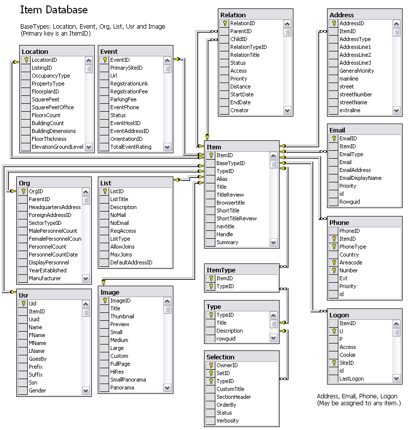

<!--Build a dev site locally or host on a server.  The following uses .NET 4.6.

Instruction below are for: Vista - Windows 7/10 / Windows Server 2008/2016 and forward.  
Commented out: XP - Windows XP / Windows Server 2005  
-->

Connect to your [Existing Windows Instances](https://console.aws.amazon.com/ec2/v2/home?Instances#Instances:)

## AWS Windows Server Setup - EC2

[Setup EC2 with Microsoft Remote Desktop](https://www.freecodecamp.org/news/ec2-with-microsoft-remote-desktop/)  
In [AWS Management Console](https://aws.amazon.com/console/), Choose Services, then EC2. In the sidebar, click Instances.  

EC2 (Elastic Compute Cloud) provides virtual server hosting -
free tier or [billable hosting](https://console.aws.amazon.com/billing/home)  
**Important:** Set up [billing monitoring](https://console.aws.amazon.com/cost-management/home?#/anomaly-detection/overview?activeTab=subscriptions) before proceding.  

Under [Billing Preferences](https://console.aws.amazon.com/billing/home?#/preferences)
<!--
Simple Notifications
https://console.aws.amazon.com/sns/v3/home?region=us-east-1#/subscriptions
-->

### Get the Public IP

In the EC2 list slide to the right and get the IPv4 DNS.  
Click the row to see the public IPv4.  

Maybe this is just for the initial remote connection? It might change when instance is restarted, hence the need to set a permanent IP.    

### Elastic IP Address Setup

Login to <a href="https://console.aws.amazon.com/">AWS Console</a> and select <a href="https://console.aws.amazon.com/ec2/v2/home?#Addresses:">EC2 Elastic IPs</a>

If Elastic IPs aren’t used, recycling or stopping/starting the instance will cause new IPs to be assigned to the server. This will not only cause websites to become inaccessible but also our ability to connect to the server using Remote Desktop. We’d have to use a different ip address each time the instance is restarted and the dns for each website would have to be updated.  

### Add additional IP addresses

Reference: <a href="https://docs.aws.amazon.com/AWSEC2/latest/UserGuide/MultipleIP.html">AWS EC2 User Guide</a> 

### Allocate Elastic IPs

[AWS elastic-ip-addresses](https://docs.aws.amazon.com/AWSEC2/latest/UserGuide/elastic-ip-addresses-eip.html)

### Configure Windows Operating System to recognize the new IPs

<a href="https://docs.aws.amazon.com/AWSEC2/latest/UserGuide/MultipleIP.html">AWS EC2 User Guide</a>  

## AWS - Add Volumes - D: websites and E: Databases  

Use the following steps to add two volumes on the AWS server, one for the websites and another for the databases.

[Create a volume](https://docs.aws.amazon.com/AWSEC2/latest/WindowsGuide/ebs-creating-volume.html). Be sure to select the same Availability Zone as the instance that the volume will be attached to. Other than the size, use the default values. Be sure to assign a name to the volume so it can be identified in the AWS console application.  

[Attach the volume to an instance](https://docs.aws.amazon.com/AWSEC2/latest/WindowsGuide/ebs-attaching-volume.html). Use the suggested Device Name.

[Make the volume available to Windows](https://docs.aws.amazon.com/AWSEC2/latest/WindowsGuide/ebs-using-volumes.html). You will see a prompt to initialize the disk. Use the default values to do this. Use the recommended Drive letter (D:, E:, etc.) or select another one. Be sure to assign the volume the same name that was used when creating the volume.

Once the drives have been set up, you should be able to see them in Windows Explorer.

[Post an issue](https://github.com/modelearth/setup/) if you'd like additional assistance with AWS EC2 Windows Server setup.  

## Install and Configure IIS

[See IIS install notes](iis/)  

Launch Internet Information Services (IIS).  
You can create one IIS entry for multiple sites that use the same IP addreess.  

<strong>Set the IIS root directory to D:\Web</strong> (or other site root folder) 
Create a Bin folder in this new site root.  Copy in existing DLLs, or run a script to build. 

<!--
Make sure a primary website is viewable in a browser while on the machine itself.  Some networks may require changes to the firewall settings.  PDF generation requires that the machine can load content via the domains it hosts. 
-->

<h2>Application Pool Setup</h2>
In IIS, you can optionally create a new Application Pool for each website. 

<ul>
<li>Set the .NET Framework Version to ASP.NET 4.0.</li>

<li>Assign the App Pool in IIS under Basic Settings</li>
</ul>

Didn't do the following yet on new server:
<ul>
<li>Set up each Application Pool to run under the Network Service Identity rather than the default ApplicationPoolIdentity Identity. This allows write permissions to be set for common folders that are used by all websites, such as for mail or upload folders, to be set up using one identity. (Else the mail pickup folder will display error: Access to the path is denied.)</li>
</ul>

Might not need to do this:
<ul>
<li>For 64-Bit operating systems - may need to set "Enable 32-Bit Applications" to True  
-- For COM dlls used by the asp pages.</li>
</ul>

<h2>Certify the Web - for Windows Servers</h2>

Certifytheweb is a Windows installer for letsencrypt.org certs.  
The free version supports up to 3 certs per server, with one cert per IIS site.  

For Windows server, download app onto server from: [certifytheweb.com](https://certifytheweb.com/)  

Install the app. There is no account login or password requested.  
Click "New Certificate" and register yourself as a new contact.  
You'll be prompted to enter an email address.  
Didn't choose "Use Staging (test) Mode"  

Associate a domain to an IP in IIS. You can use the same IP with multiple IIS sites.  
Note that the generated cert will have no IP in IIS.  

Add IP in IIS and optionally remove domain name from the new 433 binding<!-- parks site returned Not Found until this was done. -->  
Unchecked "Require Server Name Indication".  (Important, otherwise only the one domain will work)

You can point additional domains at the IP using a proxy in Cloudflare.  
With AWS EC2, the external IP differs from the IP on the machine.  

CloudFlare reuses one cert for all domains pointed at the IIS site. [Cloudflare setup](https://neighborhood.org/localsite/start/cloudflare)  
(So unchecked additional domains that were also in the IIS site.)

"Certify the Web" icon will appear on desktop.  
Simply opening will update the certs. (Worked when IP range changed, but does't work when moving to a new machine.)  

A hidden folder called .well-known will be generated at the root of your website.  
to show the certificate authority (CA) that the requester controls the domain. 
Not sure if this can be removed later.

---  

If a failure requesting the new cert occurs, in Cloudflare under "SSL/TLS" change from "Full" to "Off (not secure)". After aquiring cert, turn "Full" back on in Cloudflare to prevent "redirected you too many times" error. And reactivate "Always Use HTTPS" under SSL/TLS > Edge Certificates.  (This works when hstspreload.org is already set for domain.)<!-- note that hstspreload.org has not been turned on for areamarket -->  

Another option is to use a domain that is not already using https at Cloudflare.
(Need to test to confirm this it the case.)  
<!-- 525 error handshake fail occurs before cert added for a domain requiring https in Cloudflare -->

<h2>Install and Configure .NET, Run Windows Update</h2>

Get the latest updates related to the .NET Framework - 
<a href="https://dotnet.microsoft.com/download/dotnet-framework/">Download .NET Framework</a> using the Web Installer.<!--
OLD NOTE (We're switching to .NET 4.8, use link above)  
If not already installed, install the <a target="_blank" href="http://www.microsoft.com/en-us/download/details.aspx?id=17718">.NET Framework 4.0 (Standalone Installer)</a> or the <a target="_blank" href="http://www.microsoft.com/en-us/download/details.aspx?id=17851">.NET Framework 4.0 (Web Installer)</a>.  
-->  
The Web Installer is easy to use and ensures that any prerequisites are installed before installing the framework.  
Install the .net 4.8 developer pack on the aws server. (If it initially has 4.7)  

If a .aspx page is not recognized, don't add a Mime type. Tried the following, but not resolved:   

<!--
Try skipping this, it has no effect: 
To complete the install, go to the Windows Control Panel, choose "Turn Windows features on or off."  In the Windows Features dialog box, click Internet Information Services to install the default features. Expand the Application Development Features node and click ASP.NET [your new version] to add the features that support ASP.NET. Also install lower versions of ASP.NET such as ASP.NET 3.5. This will ensure that older programs will still be able to run. A prompt to assignm roles may pop up first. You can choose "Role-based or feature based installation". When you get to the "Features" section, expand the .NET Framework [your version] and <b>choose ASP.NET [your version]</b>. Choose the restart if needed option.  
-->

If the website has an error when loading a Core page and the error is from one of the dlls listed below, you may need to add some folders
to the Global Assembly Cache (GAC). This is located in the C:\Windows\Microsoft.NET\assembly\GAC_MSIL folder. Copy the folders in the
"Tools\ASP.NET GAC Folders" folder to the GAC folder and try to reload the Core page. Then verify that a Net page loads.
    
    Microsoft.Web.Infrastructure

Run the utility C:\DreamStudioUtilities\CreateEventLogSource to create the event log source:  
CreateEventLogSource ManagementSuiteExceptionEmail

Also run for ManagementSuiteMail:  
CreateEventLogSource ManagementSuiteMail

[Add Web server roles (ISAPI)](img/steps/add-web-server-roles.gif)  

<!--

Check which framework version is in the %windir%\Microsoft.NET\Framework64 directory and run the command with that version:  

%windir%\Microsoft.NET\Framework64\v4.0.30319\aspnet_regiis.exe -ir

XP
   
Install the <a target="_blank" href="http://www.microsoft.com/downloads/details.aspx?familyid=0856eacb-4362-4b0d-8edd-aab15c5e04f5&displaylang=en">
    .NET Framework 2.0 Redistributable Package:</a>

For laptops viewing localhost with ASP.NET 2.0, IIS also requires running: 
C:\WINDOWS\Microsoft.NET\Framework\<version>\aspnet_regiis -i  

<strong>Time:</strong> 2-4 hrs depending on updates needed
 
-->

## RDS for your SQL Database

<!--about/setup/Database.aspx'>Database Setup-->

**The cost is about over 60% more if SQL Server is pre-installed with AWS EC2 Windows due to the large size required.**  

Instead, use a medium-sized EC2 instance and create a medium-sized RDS instance for your data.  

Use the second button on the [RDS page](https://console.aws.amazon.com/rds/home) (The first is Aurora).  

1. Select Standard Create  
1. Select Sql Server engine  
1. Select Sql Server Web Edition  
1. Select the latest version (by default)  
1. Select the Production Template  
1. DB instance size > Burtable classes (includes t classes) > db.t3.medium (2 vCPUs, 4 GB RAM, 2085 Mbps)  
1. Select the Storage type: General Purpose (SSD)
1. Maximum storage threshold: 1000 GB (the default value)    
1. Default VPC (vpc-95d988ed) - only one available  
1. Select the Storage type: General Purpose (SSD)  
Enter the Allocated Storage: 100 GB (20 GB default) 100 GB per the recommendations for performance reasons. Burstability credits rebuild faster with larger storage volumes. Increases cost by about $10/mo.  
1. Storage autoscaling: Checked (by default)  
1. Maximum storage threshold: 1000 GB (the default value)  
1. Select the VPC: Default VPC (vpc-95d988ed)  
1. Select the subnet group: default  
1. Select Public Access: No (Setting to Yes would be a security risk. See the setup instructions below to allow the EC2 instance to connect to the RDS instnce)  
1. Select the VPC Security Group – default (this is the default option – not sure if this should match the EC2 security group)  
1. Select the Availability Zone: us-east-1f (Same as the EC2 instances)  
1. Microsoft SQL Server Windows Authentication: Unchecked (the default option – not sure if this is needed or how to set up)  
Did not create Windows Directory service, maybe we need to do that next time. (If doing so, set time zone to EST.)  
1. Additional configuration: Use the default options  

Add an MSSQL inbound rule to the default security group, which is the same group updated for http and https connections.  

Add the option group to create the S3 bucket etc.<!-- Don did this-->  

[Connecting to a DB Instance running Microsoft SQL Server](https://docs.aws.amazon.com/AmazonRDS/latest/UserGuide/USER_ConnectToMicrosoftSQLServerInstance.html)  
After Amazon RDS provisions your DB instance, you can use any standard SQL client application to connect to the DB instance.  

## Allow the EC2 instance to connect to the RDS instance

Reference: [Scenarios for accessing a DB instance in a VPC](https://docs.aws.amazon.com/AmazonRDS/latest/UserGuide/USER_VPC.Scenarios.html#USER_VPC.Scenario1)

The goal is to only allow the EC2 instance to access the RDS instance.  
This allows public access to the web server on the EC2 instance while keeping the RDS instance private.

See "Connect to RDS instance" notes in core-admin

<!--
Probably not used

Install as standalone server 
Use the default instance and use a different drive if possible for user databases and backups. 
<ul>
    <li>Data and Transaction Log files: E:\Data</li>
    <li>Backup Files: E:\Bkup</li>
</ul>
Install the following: 
<ul>
    <li>Full Text</li>
    <li>Client tools connectivity</li>
    <li>Integration Services</li>
    <li>Client Tools Backwards Compatibility</li>
    <li>Documentation Components</li>
</ul>
From the installation program, install Sql Server Management Studio (SSMS). For Sql Server 2016+, SSMS is a separate install  

Restore Databases, including Lookup 
Create Backup Maintenance Plans and Schedules 
Create logins 
Setup Network Connectivity and update Firewall settings. If the website and server will reside on the same server,
this step won't be needed. 
-->

## Core Data Schema  

Each entity receives an ItemID.  Items include users, events, locations, organizations, group lists.  

 

## Add Web.Config file

See notes in core-admin  

<h2>Add MIME types</h2>

<!--
The following bindings are installed in the default IIS site on Windows Server 2008.  
net.tcp, net.pipe, net.msmq, msmq.formatname  
-->

**For trail vector maps (optional):**  

	Extension: .kml  
	MIME type: application/vnd.google-earth.kml+xml  

	Extension: .kmz  
	MIME type: application/vnd.google-earth.kmz  

Avoid adding a MIME type for .aspx  
  
<a href="http://www.iis.net/configreference/system.webserver/staticcontent/clientcache#004">Set browser caching</a> - You may want to set the time to cache in the browser to one day. 
This may not be necessary now that most browsers and CDNs cache files.  

<!--
<strong>Time:</strong>&nbsp;2-4 hrs
-->

<h2>Setup Email</h2>
Setup email to allow website to send emails. 
Turn on the SMTP Service and set to Automatic Startup. 
In C:\inetpub\maillroot, give the Network Service account full permissions.  
This should be the same user account that the IIS Application Pools runs under.  

<!--
<strong>Time:</strong>&nbsp; 1-2 hrs
-->

    
<h2>Directory Permission Setting</strong></h2>
Apply the following permission change to the following folders: 
<ul>
    <li>Files</li>
    <li>Source - Larger original versions</li>
    <li>Removed - Source images stored for resizing, but expendable if storage reaches max.</li>
    <li>Page</li>
</ul>

<!--
Permission change probably not needed here:
<ul>
    <li>Content - 2004 to 2013. Prior to "go" folder and other repos. Included FTP uploads.</li>
</ul>
-->

Right click on the Files directory and select Properties. Click on the Security tab. 

<!--
	XP
Right click on the Files directory and select Sharing and Security. 
-->
Click Add to enter the Network Service username if not already present.  

	[Machine Name]\NETWORK SERVICE  

Give it Full Control. Click Advanced. Keep the first box checked and also check
the second "Replace permission entries on all child objects..."  

## Create a Backup Snapshot

To make a backup, switch from using static IP addresses back to using DHCP, create a snapshot, then re-add the secondary IP addresses after making the backup.  As a result, your websites will be down about 10-15 minutes while you are taking the snapshot.  

If you don't switch to static IPs, your install from the snapshot will return a 1/2 complete error.  

## Updates

#### Deployment Updates

2021 - EC2/RDS setup notes  
2020 - Streamlining server migration.  
2019 - Updates for deployment from Github. 

#### Cloudflare HTTPS Certs

2018 - Switch to free CloudFlare certs for https security.

#### Email Summary Updates

2017 - Email summaries of exceptions are now sent to admins once every 30 minutes containing the remote IPs and the counts per IP address.  Added to adjust for bursts of emails during high traffic.  

For PageName, we've added the highlighted line. If the script_name ends with a trailing slash, as in “/events/”, we return an empty string rather than “events”.  

For IContains, we now check for an empty string as well as null. If the string had been empty, IContains would have returned 0 as the index, and therefore true, rather than false as would be expected.  

#### Custom Page URLs

2016 - Added support for custom page URLs for improved search indexing and short URLs.  

#### Static Page Generation Updates

2015 - Pages generated from multiple queries are now stored in static folders for fast loading.  

<!--
    Fork the Core repo, copy in recent changes from NAAEE version. Changes are primarily removal of remaining IsSite settings. These can be replaced with database settings in the "site" table.
-->
 

